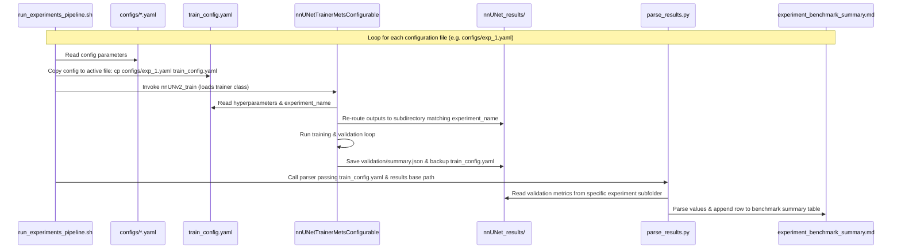

# nnU-Net Pipeline Execution Guide (Server)

This guide provides the exact Docker commands required to execute the full nnU-Net pipeline on the lab virtual machine. All commands use the server's specific volume mount path:
`/mnt/local/data/rainsun/metastases/Rain-BrainMetastases-main/train/nnUNet_rain/nnUnet_dataset`

## 1. Verify Dataset Integrity
Before running the heavy preprocessing, it is best practice to quickly check that your dataset is formatted correctly and free of corruption. This extracts the fingerprint without doing the resampling.

```bash
docker run --gpus all -it --rm \
  -v /mnt/local/data/rainsun/metastases/Rain-BrainMetastases-main/train/nnUNet_rain/nnUnet_dataset:/workspace/nnunet_data \
  nnunet-rain "nnUNetv2_extract_fingerprint -d 1 --verify_dataset_integrity"
```

## 2. Planning and Preprocessing
Once integrity is verified, execute the heavy preprocessing. This will calculate the experiment plans, crop the images, standardize the spacing, and apply z-score normalization. The results are saved to `nnUNet_preprocessed/`.

```bash
docker run --gpus all -it --rm \
  -v /mnt/local/data/rainsun/metastases/Rain-BrainMetastases-main/train/nnUNet_rain/nnUnet_dataset:/workspace/nnunet_data \
  nnunet-rain "nnUNetv2_plan_and_preprocess -d 1 --verify_dataset_integrity"
```

## 3. Training

### Option A: Standard 3D Full-Resolution Baseline
To train the default single-stage `3d_fullres` model (e.g., using GPUs 0 and 1):
```bash
CUDA_VISIBLE_DEVICES=0,1 docker run --gpus all -it --rm --shm-size=32g \
  -v /mnt/local/data/rainsun/metastases/Rain-BrainMetastases-main/train/nnUNet_rain/nnUnet_dataset:/workspace/nnunet_data \
  nnunet-rain "nnUNetv2_train 1 3d_fullres 0 -num_gpus 2"
```

### Option B: Residual Encoder Configuration (Recommended for L40S/High VRAM)
If the default configuration plateaus, you can train a model using residual blocks instead of plain convolutional blocks. Note: The cascade configuration (`3d_lowres`) is automatically omitted by nnU-Net's planner if the dataset's cropped brain volume sizes are small enough to fit within a standard full-resolution patch. In such cases, the Residual Encoder (`ResEnc`) architecture is the primary method to improve feature representation.

#### Step 1: Generate the Residual Encoder Plan (within your container)
Run the experiment planner using the large preset:
```bash
docker run --gpus all -it --rm \
  -v /mnt/local/data/rainsun/metastases/Rain-BrainMetastases-main/train/nnUNet_rain/nnUnet_dataset:/workspace/nnunet_data \
  nnunet-rain "nnUNetv2_plan_experiment -d 1 -pl nnUNetPlannerResEncL"
```

#### Step 2: Train the Residual Encoder Model
Train the model by referencing the newly generated plans (`nnUNetResEncUNetLPlans`):
```bash
CUDA_VISIBLE_DEVICES=2 docker run --gpus all -it --rm --shm-size=32g \
  -v /mnt/local/data/rainsun/metastases/Rain-BrainMetastases-main/train/nnUNet_rain/nnUnet_dataset:/workspace/nnunet_data \
  nnunet-rain "nnUNetv2_train 1 3d_fullres 0 -p nnUNetResEncUNetLPlans -num_gpus 1"
```

### Option C: Custom Hyperparameter Tuning (Residual Encoder + Regularization)
For highly optimized training using custom spatial dropout, scaled batch size, AdamW optimizer, custom learning rate/weight decay, and early stopping at 500 epochs:

#### Step 1: Run Preprocessing for Custom Plans
Since the configuration (such as batch size and dropout) in the custom plans file `nnUNetResEncUNetLPlans_custom_0624.json` has been updated, you must run preprocessing for this specific plans file first:
```bash
docker run --gpus all -it --rm \
  -v /mnt/local/data/rainsun/metastases/Rain-BrainMetastases-main/train/nnUNet_rain/nnUnet_dataset:/workspace/nnunet_data \
  nnunet-rain "nnUNetv2_preprocess -d 1 -c 3d_fullres -plans nnUNetResEncUNetLPlans_custom_0624"
```

#### Step 2: Run Custom Training
Since the container's python environment is installed in editable mode from the code directory `/opt/nnunet`, you need to either **mount your code directory** or **rebuild the Docker image** so the container can find the new custom `nnUNetTrainerMets` class.

##### Method A: Mount the Code Directory (Recommended for Live Hyperparameter Tuning)
By adding `-v .../train/nnUNet_rain:/opt/nnunet`, any updates you make to the trainer python files on the host are immediately reflected inside the running container without needing a rebuild:
```bash
CUDA_VISIBLE_DEVICES=0,1,2,3 docker run --gpus all -it --rm --shm-size=32g \
  -v /mnt/local/data/rainsun/metastases/Rain-BrainMetastases-main/train/nnUNet_rain/nnUnet_dataset:/workspace/nnunet_data \
  -v /mnt/local/data/rainsun/metastases/Rain-BrainMetastases-main/train/nnUNet_rain:/opt/nnunet \
  nnunet-rain "nnUNetv2_train 1 3d_fullres 0 -p nnUNetResEncUNetLPlans_custom_0624 -tr nnUNetTrainerMets -num_gpus 4"
```
*(If you are running on 2 GPUs, adjust `CUDA_VISIBLE_DEVICES=1,2` and `-num_gpus 2` accordingly)*

##### Method B: Rebuild the Docker Image
Alternatively, rebuild the Docker image to bake the new trainer class into the container's environment (must be run inside the `train/nnUNet_rain` directory containing the `Dockerfile`):
```bash
docker build -t nnunet-rain .
```
After building, you can run training without mounting the code directory:
```bash
CUDA_VISIBLE_DEVICES=0,1,2,3 docker run --gpus all -it --rm --shm-size=32g \
  -v /mnt/local/data/rainsun/metastases/Rain-BrainMetastases-main/train/nnUNet_rain/nnUnet_dataset:/workspace/nnunet_data \
  nnunet-rain "nnUNetv2_train 1 3d_fullres 0 -p nnUNetResEncUNetLPlans_custom_0624 -tr nnUNetTrainerMets -num_gpus 4"
```

## 4. Weights & Biases (W&B) Logging

nnU-Net has a built-in logger that can stream metrics (loss, validation Dice, learning rates, system usage) directly to [wandb.ai](https://wandb.ai) in real time.

### Step 1: Set up the `.env` configuration file
To keep API keys and logging variables secure and out of version control, copy the template `.env.example` file to `.env` on the host:
```bash
cp .env.example .env
```
Edit the `.env` file to insert your W&B API key and preferred project name:
```env
nnUNet_wandb_enabled=True
nnUNet_wandb_project=brain-mets-segmentation
nnUNet_wandb_mode=online
WANDB_API_KEY=your_actual_wandb_api_key_here
```

### Step 2: Run training with W&B configuration
To pass these settings to the Docker container, use Docker's `--env-file` parameter. 

For example, when running custom training with the code mounted (Method A):
```bash
CUDA_VISIBLE_DEVICES=0,1,2,3 docker run --gpus all -it --rm --shm-size=32g \
  --env-file .env \
  -v /mnt/local/data/rainsun/metastases/Rain-BrainMetastases-main/train/nnUNet_rain/nnUnet_dataset:/workspace/nnunet_data \
  -v /mnt/local/data/rainsun/metastases/Rain-BrainMetastases-main/train/nnUNet_rain:/opt/nnunet \
  nnunet-rain "nnUNetv2_train 1 3d_fullres 0 -p nnUNetResEncUNetLPlans_custom_0624 -tr nnUNetTrainerMets -num_gpus 4"
```

---

## 5. Inference (Prediction)
After training is complete, you can generate predictions on new, unseen data. You will need to map an additional input directory containing the new raw scans, and an output directory for the predictions.

### Standard Full-Resolution Inference
```bash
docker run --gpus all -it --rm \
  -v /mnt/local/data/rainsun/metastases/Rain-BrainMetastases-main/train/nnUNet_rain/nnUnet_dataset:/workspace/nnunet_data \
  -v /path/to/server/input_scans:/workspace/input \
  -v /path/to/server/output_predictions:/workspace/output \
  nnunet-rain "nnUNetv2_predict -i /workspace/input -o /workspace/output -d 1 -c 3d_fullres -f 0"
```

### Residual Encoder Full-Resolution Inference
If you trained using the Residual Encoder plan, you must pass the matching plan name to the predictor:
```bash
docker run --gpus all -it --rm \
  -v /mnt/local/data/rainsun/metastases/Rain-BrainMetastases-main/train/nnUNet_rain/nnUnet_dataset:/workspace/nnunet_data \
  -v /path/to/server/input_scans:/workspace/input \
  -v /path/to/server/output_predictions:/workspace/output \
  nnunet-rain "nnUNetv2_predict -i /workspace/input -o /workspace/output -d 1 -c 3d_fullres -f 0 -p nnUNetResEncUNetLPlans"
```

### Custom Tuning Full-Resolution Inference
If you trained using the custom plans and custom trainer:
```bash
docker run --gpus all -it --rm \
  -v /mnt/local/data/rainsun/metastases/Rain-BrainMetastases-main/train/nnUNet_rain/nnUnet_dataset:/workspace/nnunet_data \
  -v /mnt/local/data/rainsun/metastases/Rain-BrainMetastases-main/train/nnUNet_rain:/opt/nnunet \
  -v /path/to/server/input_scans:/workspace/input \
  -v /path/to/server/output_predictions:/workspace/output \
  nnunet-rain "nnUNetv2_predict -i /workspace/input -o /workspace/output -d 1 -c 3d_fullres -f 0 -p nnUNetResEncUNetLPlans_custom_0624 -tr nnUNetTrainerMets"
```
*(Make sure to replace the `/path/to/server/...` paths with the actual paths to your test data)*

---

## 6. Configurable Training & Automated Experimentation Pipeline

For rapid experimentation, we created a configurable trainer class `nnUNetTrainerMetsConfigurable` that reads parameters dynamically from a YAML file, rather than hardcoding them in Python classes.

### Pipeline Workflow Overview

The sequential training pipeline automates hyperparameter searches, manages separate output directories to avoid overrides, and collects metrics into a unified summary table.



#### Step-by-Step Execution Sequence
1. **Config Preparation**: You create experiment YAML files in the `configs/` directory. Each file defines the unique settings for that run (e.g., learning rates, dropout, weights).
2. **Configuration Overwrite**: When the pipeline script (`run_experiments_pipeline.sh` or `run_test_pipeline.sh`) starts an iteration, it copies the chosen config file to `train_config.yaml`.
3. **Hyperparameter Ingestion**: The training command is called. The class `nnUNetTrainerMetsConfigurable` loads the properties from the transient `train_config.yaml` file.
4. **Dynamic Output Redirection**: To prevent experiments from writing to the same directory and overwriting weights/logs, the trainer automatically intercepts the output directory initialization:
   * It appends the `experiment_name` to the directory name:
     `nnUNetTrainerMetsConfigurable_{experiment_name}__nnUNetResEncUNetLPlans_custom_0624__3d_fullres`
   * It creates a backup copy of the `train_config.yaml` inside the redirected results directory for tracking.
5. **Metric Scraping**: Once training and fold validation finish, `parse_results.py` reads the active `train_config.yaml` to identify the experiment name, searches the base directory for the corresponding output folder, parses `validation/summary.json`, and appends the final metrics to a markdown benchmark file.

---

### The Role of Intermediate Files

#### `train_config.yaml` (Active/Transient Configuration)
* **What it is**: The standard, hardcoded target path where `nnUNetTrainerMetsConfigurable` expects to read parameters.
* **Why it exists**: It isolates the Python code from the filesystem's specific sweep paths. The trainer always checks this single file.
* **Ignored by Git**: Because this file is constantly rewritten on-the-fly with the parameters of the active experiment iteration, it is added to `.gitignore`. This ensures your git history doesn't capture local pipeline changes.
* **Manual training fallback**: If you want to run a single custom training session manually, you can simply edit this file directly and run the standard training command without using the pipeline.

#### `configs/` (Source Configurations)
* **What they are**: Permanent, version-controlled records of your experimental designs (e.g., `configs/exp_lr_1e-4_wd_5e-4.yaml`).
* **Role**: These serve as the master inputs to the pipeline and should be committed to Git.

---

### Running the Pipeline Options

#### Option D: Configurable Training (Single Run)
If you want to run a single manual training session, edit `train_config.yaml` to configure your values, and execute:
```bash
CUDA_VISIBLE_DEVICES=0,1,2,3 docker run --gpus all -it --rm --shm-size=32g \
  --env-file .env \
  -v /mnt/local/data/rainsun/metastases/Rain-BrainMetastases-main/train/nnUNet_rain/nnUnet_dataset:/workspace/nnunet_data \
  -v /mnt/local/data/rainsun/metastases/Rain-BrainMetastases-main/train/nnUNet_rain:/opt/nnunet \
  nnunet-rain "cd /opt/nnunet && nnUNetv2_train 1 3d_fullres 0 -p nnUNetResEncUNetLPlans_custom_0624 -tr nnUNetTrainerMetsConfigurable -num_gpus 4"
```

#### Option E: Automated Multi-Experiment Pipeline Execution (Sweeps)
To run a batch of sequential configurations (as defined in `run_experiments_pipeline.sh`):
```bash
CUDA_VISIBLE_DEVICES=0,1,2,3 docker run --gpus all -it --rm --shm-size=32g \
  --env-file .env \
  -v /mnt/local/data/rainsun/metastases/Rain-BrainMetastases-main/train/nnUNet_rain/nnUnet_dataset:/workspace/nnunet_data \
  -v /mnt/local/data/rainsun/metastases/Rain-BrainMetastases-main/train/nnUNet_rain:/opt/nnunet \
  nnunet-rain "cd /opt/nnunet && chmod +x run_experiments_pipeline.sh && ./run_experiments_pipeline.sh"
```
Once complete, you can review the results of all configurations side-by-side in:
`training_plan_and_log/experiment_benchmark_summary.md`