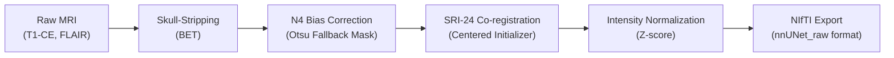

# Dataset Preprocessing & Model Training History

This document details the preprocessing methodology applied to the Brain Metastases datasets, defines the hyperparameter configurations for all previous training runs, and logs the comparative training and validation performance.

---

## 1. Dataset Preprocessing Pipeline (`rain_preprocess`)

Both the **UCSF Brain Mets** and **Brain-Mets-Lung** cohorts were standardly processed using the unified `rain_preprocess.py` script. The pipeline contains the following stages:



### Preprocessing Steps & Technical Details:
1. **Skull Stripping**: Isolates the brain tissue from non-brain tissues (scalp, skull, neck) using brain extraction algorithms.
2. **N4 Bias Field Correction**: Resolves low-frequency RF coil inhomogeneities using SimpleITK's `N4BiasFieldCorrectionImageFilter`.
   * *Otsu Fallback Masking*: Since brain masks were not pre-computed, an automatic Otsu thresholding filter (`sitk.OtsuThreshold`) is computed on the fly to isolate the foreground. The bias field is estimated *only* inside this mask, preventing empty background air from corrupting the N4 calculation.
3. **Template Registration (SRI-24 Space)**: Spatial alignment to the SRI-24 anatomical template.
   * *Centered Initializer Resolution*: The raw coordinate spaces between templates and patient scans had an offset of $\sim 19.5\text{ cm}$. To prevent the optimizer from converging to local cutoffs (truncating $3/4$ of the brain), we utilized `CenteredTransformInitializerFilter.GEOMETRY` to physically center-align the grids before running the registration optimization.
4. **Intensity Normalization**: Performs standard z-score normalization ($Z = \frac{x - \mu}{\sigma}$) of voxel intensities within the extracted brain mask.

---

## 2. Hyperparameter Configuration History

We have run three main experimental configurations for model training on Dataset001 (Fold 0):

### Experiment 1: Standard Baseline (`nnUNetTrainer` + Plain UNet)
* **Architecture**: Plain 3D U-Net (standard nnU-Net design).
* **Optimizer**: Stochastic Gradient Descent (SGD) with Nesterov Momentum ($0.99$).
* **Initial Learning Rate**: $10^{-2}$ (polynomial schedule decay).
* **Weight Decay**: $3 \times 10^{-5}$.
* **Regularization**: None (`"dropout_op": null`).
* **Batch Size**: 2.
* **Patch Size**: $[80, 192, 160]$ (Median spacing: $[1.5, 0.86, 0.86]$).
* **Training Length**: 1000 epochs (analyzed at Epoch 365).
* **Labels**: Class-based (mutually exclusive).

### Experiment 2: Standard Residual Encoder (`nnUNetTrainer` + ResEnc UNet)
* **Architecture**: Large Residual Encoder U-Net (`nnUNetPlannerResEncL`).
* **Optimizer**: Stochastic Gradient Descent (SGD) with Nesterov Momentum ($0.99$).
* **Initial Learning Rate**: $10^{-2}$ (polynomial schedule decay).
* **Weight Decay**: $3 \times 10^{-5}$.
* **Regularization**: None (`"dropout_op": null`).
* **Batch Size**: 5.
* **Patch Size**: $[96, 224, 160]$ (fully covers brain anatomy bounds).
* **Training Length**: 1000 epochs (training log currently runs up to Epoch 776).
* **Labels**: Class-based (mutually exclusive).

### Experiment 3: Custom Residual Encoder (`nnUNetTrainerMets` + ResEnc UNet)
* **Architecture**: Large Residual Encoder U-Net (`nnUNetPlannerResEncL`).
* **Optimizer**: AdamW with `amsgrad = True`.
* **Initial Learning Rate**: $3 \times 10^{-4}$ (polynomial schedule decay).
* **Weight Decay**: $1 \times 10^{-4}$.
* **Regularization**: 3D Spatial Dropout (`p = 0.2` in encoder stages).
* **Batch Size**: 4 (scaled for large L40 40GB GPUs).
* **Patch Size**: $[96, 224, 160]$ (fully covers brain anatomy bounds).
* **Training Length**: 500 epochs (training log currently runs up to Epoch 142).
* **Labels**: Class-based (mutually exclusive).

---

## 3. Training & Validation Results

### 3.1 Quantitative Performance Comparison

The table below outlines the comparison between all three historical experiments (baseline standard run, standard ResEnc run using SGD, and custom ResEnc run using AdamW):

| Metric | Exp 1: Baseline (Avg Epoch 365) | Exp 2: ResEnc SGD (Peak Epoch 402) | Exp 2: ResEnc SGD (Epoch 775) | Exp 3: ResEnc AdamW (Peak Epoch 135) | Exp 3: ResEnc AdamW (Epoch 141) |
| :--- | :--- | :--- | :--- | :--- | :--- |
| **Validation Loss** | $\sim -0.2100$ | $-0.3704$ | **$-0.4419$** | $-0.2579$ | $-0.2133$ |
| **Training Loss** | $\sim -0.3500$ | $-0.5790$ | **$-0.7082$** | $-0.3933$ | $-0.4173$ |
| **EMA Pseudo-Dice** | N/A (Standard SGD log) | **$53.83\%$** | $53.83\%$ | $51.57\%$ | $50.31\%$ |
| **Mean Pseudo-Dice** | $25.33\%$ | **$62.71\%$** | $39.07\%$ | $56.84\%$ | $46.88\%$ |
| **Class 1 Dice (Edema)** | $40.13\%$ | $63.09\%$ | $63.65\%$ | $64.14\%$ | **$64.82\%$** |
| **Class 2 Dice (Necrosis)** | $20.32\%$ | **$63.08\%$** | $25.61\%$ | $54.31\%$ | $40.58\%$ |
| **Class 3 Dice (Enhancing)**| $15.53\%$ | **$61.97\%$** | $27.94\%$ | $52.10\%$ | $35.25\%$ |

> [!NOTE]
> **Understanding "Pseudo-Dice" vs. Final Validation Dice:**
> * For **Experiment 2** and **Experiment 3**, the runs were paused/stopped before completing their planned training cycles. Because these runs did not finish, nnU-Net has not run its final full-resolution validation script (which yields a `summary.json`). Therefore, the validation results shown for these runs represent the **Pseudo-Dice** scores printed in the training logs, which are evaluated on random validation patches during training.
> * **EMA Pseudo-Dice** is the Exponential Moving Average used to determine weight checkpointing.


---

## 4. Diagnostic Log Analysis (Run 2)

The training log of the custom Residual Encoder run [training_log_2026_6_24_17_20_00.txt](file:///Users/rains/rainworkspace/2-IDIALab/Rain-BrainMetastases-main/train/nnUNet_rain/nnUnet_dataset/nnUNet_results/Dataset001_UCSFbrainmets/nnUNetTrainerMets__nnUNetResEncUNetLPlans_custom_0624__3d_fullres/fold_0/training_log_2026_6_24_17_20_00.txt) reveals a sudden performance collapse after Epoch 135:

```
Epoch 135: Pseudo dice [0.6414, 0.5431, 0.5207] | val_loss -0.2579 (Optimal Peak)
Epoch 136: Pseudo dice [0.5559, 0.4432, 0.4101] | val_loss -0.2356
Epoch 137: Pseudo dice [0.6330, 0.2515, 0.1890] | val_loss -0.1932 (Severe Drop in Class 2 & 3!)
Epoch 138: Pseudo dice [0.5383, 0.3529, 0.2781] | val_loss -0.1971
...
Epoch 141: Pseudo dice [0.6482, 0.4058, 0.3525] | val_loss -0.2133 | train_loss -0.4173
```

### Key Technical Findings:
1. **Severe Class 3 (Enhancing active tumor) Decline**: In Epoch 137, the enhancing tumor Dice dropped to **$18.9\%$**. Because enhancing metastases are tiny and sparse, they contribute very few voxels. Without region-based boundaries, minor voxel misalignments lead to extreme gradient penalties, causing optimization instability.
2. **Divergent Loss Curves**: The training loss continued to improve (moving to a lower value of $-0.4173$ at Epoch 141), whereas the validation loss degraded from $-0.2579$ to $-0.2133$. This indicates standard overfitting: the model is memorizing background structures of the training distribution, yielding false positives on normal structures in the validation set.
3. **Slow Learning Rate Decay**: At Epoch 135, the poly-decayed learning rate remains at $0.00023$, which is too high. This prevents the optimizer weights from settling, resulting in validation loss oscillations.

### Next Step Strategy
To resolve this validation variance, we should configure **Region-Based Training** using the configurable trainer [nnUNetTrainerMetsConfigurable.py](file:///Users/rains/rainworkspace/2-IDIALab/Rain-BrainMetastases-main/train/nnUNet_rain/nnunetv2/training/nnUNetTrainer/variants/nnUNetTrainerMetsConfigurable.py) and adjust [train_config.yaml](file:///Users/rains/rainworkspace/2-IDIALab/Rain-BrainMetastases-main/train/nnUNet_rain/train_config.yaml) to:
* Set region definitions: Whole Tumor (`label_1+2+3`), Tumor Core (`label_2+3`), and Enhancing Tumor (`label_3`).
* Reduce initial learning rate to `2e-4` and increase weight decay to `3e-4` to enforce stronger regularization.
